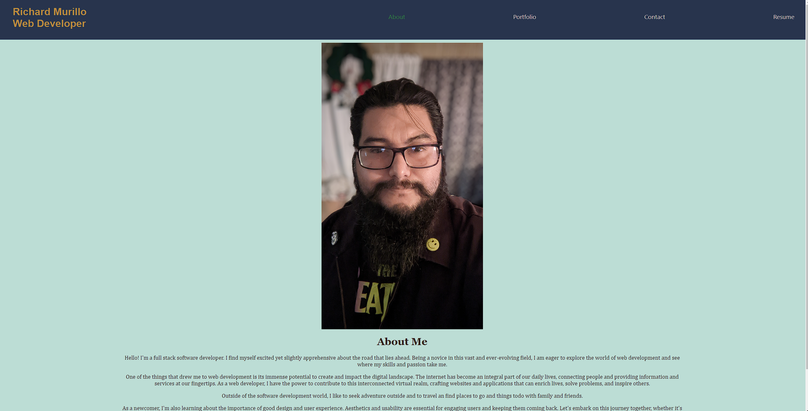
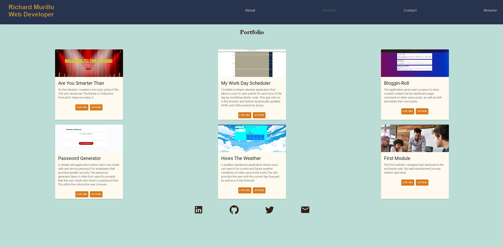
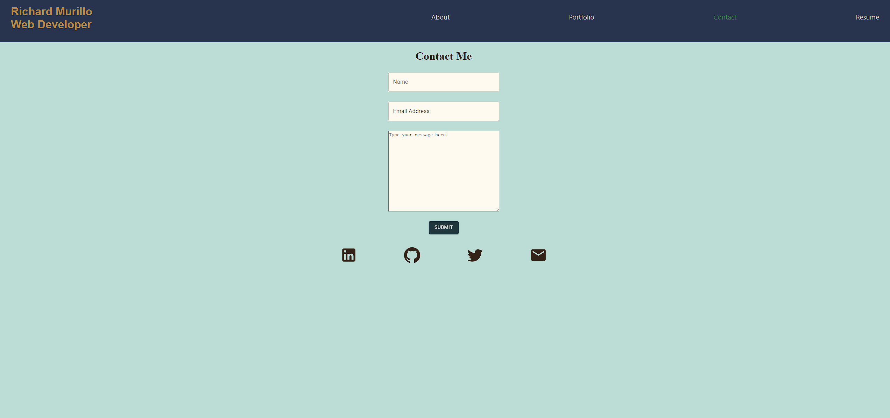
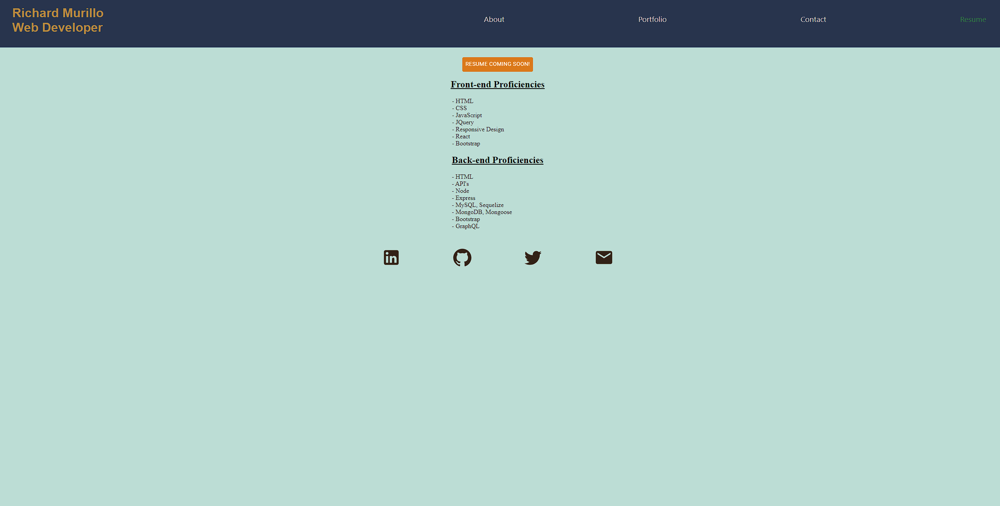

Richard Murillo's README


 # Portfolio-React-Edition

[](https://opensource.org/licenses/MIT)

## Table of Contents

 * [Description](#description)

 * [Live-URL](#live-url)

 * [Screenshots](#screenshots)

 * [Technologies-Used](#technologies-used)

 * [Installation](#installation)

 * [Usage-Information](#usage-information)

 * [Contribution-Guidelines](#contribution-guidelines)

 * [Test-Instructions](#test-instructions)

 * [License](#license)

 * [Questions](#questions)

## Description
👩🏻‍💻

portfolio application was developed and designed to showcase my web applications and skills to potential employers, clients, and interested parties. It was created using React an open sourced JavaScript library for building user interfaces, and Material-UI, a popular component library that implements Google's Material Design. Efficient rendering through the virtual DOM, and a declarative syntax. It operates via a one page application, but gives the user experience of multiple page functionality.

## Live URL
📼


[Link to Github Pages](https://richmur84.github.io/Portfolio-React-Edition/)


## Screenshots
📸






## Technologies Used
✅


## Installation

💾

1. Pull down and/or branch this repository
2. Run ```npm i``` to install all dependencies
3. Invoke application with ```npm run start```
4. Go to the port on your local host.


## Usage Information

🔌

Navigate through different pages using the links in the nav-bar, and view desired content.

## Contribution Guidelines

💬

Open to collaboration, Please wait for approval before merging to the main branch.

## Test Instructions

📖
No tests have been implemented yet!


## License
📝

NOTICE: This application is covered under the MIT

## Questions

👥

Have additional questions? Click the links below to reach me through my GitHub account or Email address.


[Link to Github](https://github.com/RichMur84)


<a href="mailto:grizzlylbc1@gmail.com">grizzlylbc1@gmail.com</a>

